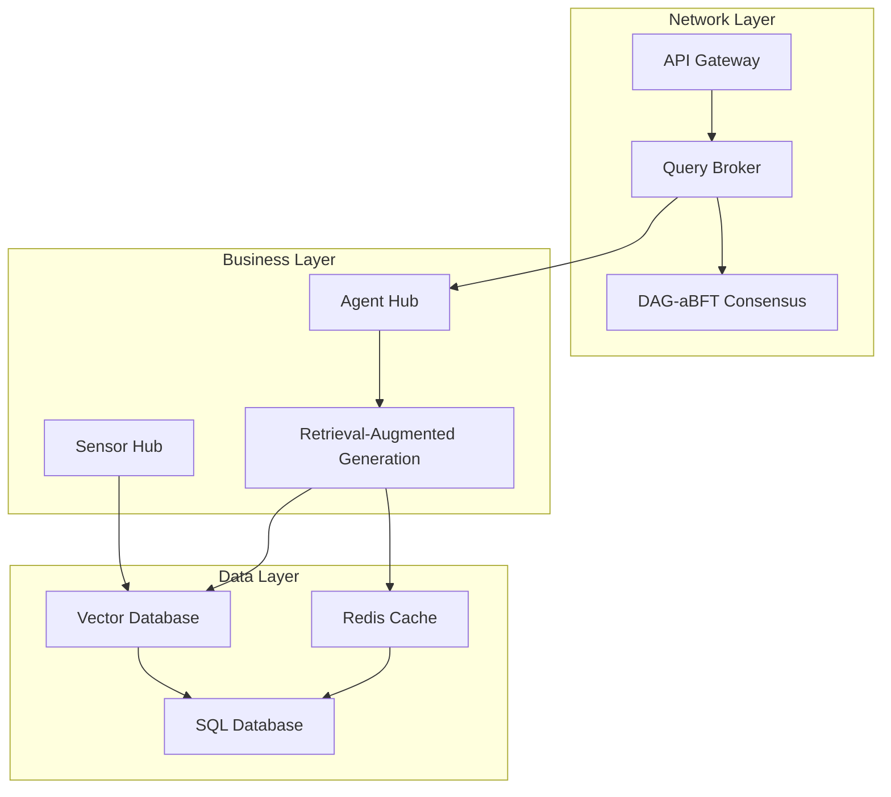

# Architecture Overview

The Loreum Cortex node is designed as a modular, layered system that enables decentralized AI inference across a peer-to-peer network. The architecture follows a three-tier design with clear separation of concerns:

## System Architecture Diagram

## The Three Layers

### 1. Network Layer

The Network Layer handles all external communication and ensures consistency across the network. Key components include:

- **API Gateway**: Provides RESTful and gRPC endpoints for external interaction with the node
- **DAG-aBFT Consensus**: Implements a Directed Acyclic Graph-based asynchronous Byzantine Fault Tolerance consensus mechanism
- **Query Broker**: Routes queries to appropriate agents and tracks their state

The Network Layer is built on libp2p, providing robust peer-to-peer communication capabilities with features like NAT traversal, peer discovery, and secure communication channels.

### 2. Business Layer

The Business Layer contains the core intelligence and processing components:

- **Agent Hub**: Orchestrates AI agents that process queries
- **Sensor Hub**: Collects and processes data from various sources
- **RAG (Retrieval-Augmented Generation)**: Enhances AI responses with context from a knowledge base

This layer implements the business logic specific to the AI inference tasks, managing the lifecycle of queries, data collection, and response generation.

### 3. Data Layer

The Data Layer provides persistent storage and efficient data retrieval:

- **SQL Database**: Stores structured data and relationships
- **Redis Cache**: Provides high-speed caching for frequently accessed data
- **Vector Database**: Enables semantic search and similarity matching for RAG

The Data Layer is designed for scalability and performance, with optimized storage structures for different data types.

## Key Design Principles

1. **Modularity**: Each component is designed with clear interfaces, allowing for independent development and testing.
2. **Scalability**: The system can scale horizontally by adding more nodes to the network.
3. **Fault Tolerance**: The DAG-aBFT consensus mechanism ensures the system can tolerate Byzantine faults.
4. **Performance**: Optimized data structures and algorithms ensure efficient processing of queries.
5. **Security**: End-to-end encryption and signature verification protect data integrity and privacy.

## Cross-Cutting Concerns

Several aspects cut across all layers:

- **Reputation System**: Tracks node performance and reliability
- **Economic Incentives**: Rewards nodes for contribution to the network
- **Monitoring & Logging**: Provides observability into system operation
- **Configuration Management**: Allows customization of node behavior

## Next Steps

- Learn about the [System Components](system-components.md)
- Understand the [Core Concepts](core-concepts.md)
- Explore the [Network Layer](../network/p2p-network.md) in more detail 