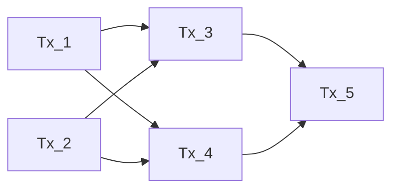
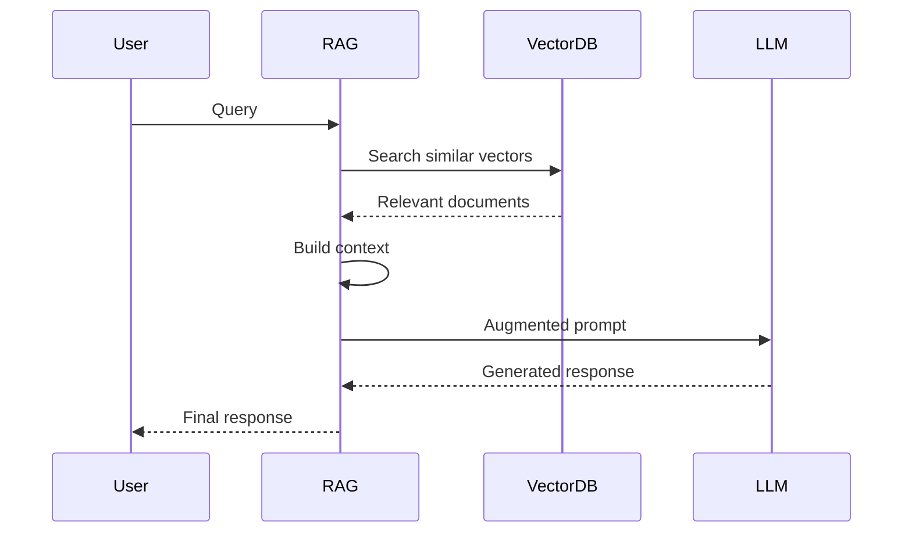

# Core Concepts

This document explains the fundamental concepts and terminology used in the Loreum Cortex system. Understanding these concepts is essential for working with and extending the system.

## Decentralized AI Inference

Loreum Cortex implements a decentralized approach to AI inference, where computational resources are distributed across a network of nodes rather than centralized in a single provider. This enables:

- **Resilience**: The system continues to function even if some nodes fail
- **Scalability**: The network can scale by adding more nodes
- **Privacy**: Data can be processed locally or in a privacy-preserving manner
- **Economic incentives**: Node operators are rewarded for their participation

## DAG-aBFT Consensus

The Directed Acyclic Graph-based asynchronous Byzantine Fault Tolerance (DAG-aBFT) consensus mechanism is core to Loreum Cortex's operation.

### Directed Acyclic Graph (DAG)

A DAG is a graph data structure where edges have direction and there are no cycles. In Loreum Cortex:

- Each **transaction** (query or response) is a node in the DAG
- Transactions reference previous transactions as their **parents**
- This creates a partial ordering of transactions without requiring strict sequencing

### Byzantine Fault Tolerance (BFT)

BFT refers to a system's ability to continue functioning correctly even when some nodes (up to a certain threshold) behave maliciously or fail. In Loreum Cortex:

- Nodes validate transactions using cryptographic signatures
- The consensus mechanism ensures that honest nodes agree on the state of the DAG
- The system can tolerate up to 1/3 of nodes being Byzantine (malicious or faulty)

### Asynchronous BFT (aBFT)

The asynchronous aspect means that the system does not rely on synchronized clocks or bounded message delivery times, making it robust in real-world network conditions.

## Retrieval-Augmented Generation (RAG)

RAG is a technique that enhances large language model (LLM) responses by retrieving relevant information from a knowledge base.

### Key Components of RAG:

1. **Vector Embeddings**: Text is converted to numerical vectors that capture semantic meaning
2. **Vector Database**: Stores embeddings for efficient similarity search
3. **Retrieval**: Finding relevant documents based on query similarity
4. **Context Augmentation**: Enhancing the prompt with retrieved information
5. **Generation**: Producing a response that incorporates the retrieved context

## Agent-Based Architecture

Loreum Cortex uses an agent-based architecture where specialized components handle different aspects of the system.

### Types of Agents:

- **Solver Agent**: Processes inference queries using AI models
- **Retriever Agent**: Finds relevant information from various sources
- **Parser Agent**: Interprets and structures queries
- **Ranker Agent**: Evaluates and ranks responses
- **Slasher Agent**: Identifies and penalizes malicious behavior

Agents have defined interfaces, making the system extensible and allowing for specialized implementations.

## Sensor Network

The Sensor Hub collects data from various sources, enabling the system to respond to real-world events.

### Types of Sensors:

- **Blockchain Sensor**: Monitors blockchain networks for relevant events
- **API Sensor**: Polls external APIs for data
- **Social Media Sensor**: Tracks social media platforms for relevant content

Sensors emit events that can trigger actions in the system, enabling reactive behavior.

## Reputation System

The reputation system tracks the performance and reliability of nodes in the network.

### Key Aspects:

- **Performance Metrics**: Response time, success rate, and availability
- **Stake**: Nodes can stake tokens to signal commitment
- **Slashing**: Penalties for malicious or underperforming nodes
- **Rewards**: Incentives for contributing to the network

The reputation score influences a node's weight in the consensus process and its share of rewards.

## Transactions and Finality

In Loreum Cortex, all operations (queries, responses, data updates) are represented as transactions in the DAG.

### Transaction Lifecycle:

1. **Creation**: A node creates a transaction and signs it with its private key
2. **Propagation**: The transaction is broadcast to the network
3. **Validation**: Receiving nodes validate the transaction
4. **Inclusion**: The transaction is added to the local DAG
5. **Finalization**: The transaction reaches consensus and is considered finalized

Once finalized, a transaction is immutable and its effects are applied to the system state.

## Next Steps

- See the [System Components](system-components.md) to understand how these concepts are implemented
- Learn about the [P2P Network](../network/p2p-network.md) infrastructure
- Explore [Agent Hub](../business/agent-hub.md) to understand agent interaction 