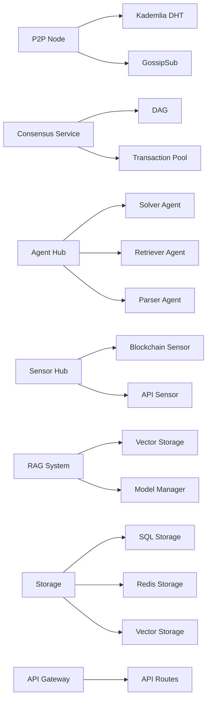

# System Components

This document describes the key components of the Loreum Cortex system, their responsibilities, and how they interact with each other.

## Component Overview



## Network Layer Components

### P2P Node

The P2P Node is the foundation of the network layer, enabling communication between nodes in the decentralized network. It is implemented using libp2p.

**Key responsibilities:**
- Managing peer connections
- NAT traversal and peer discovery
- Secure communication channels
- Message routing

**Implementation:**
```go
// P2PNode represents a P2P network node
type P2PNode struct {
    Host          host.Host
    DHT           *dht.IpfsDHT
    PubSub        *pubsub.PubSub
    Topics        map[string]*pubsub.Topic
    Subscriptions map[string]*pubsub.Subscription
    Config        *types.NetworkConfig
}
```

### Consensus Service

The Consensus Service ensures all nodes in the network agree on the state of the system. It implements a DAG-based asynchronous Byzantine Fault Tolerance (aBFT) consensus algorithm.

**Key responsibilities:**
- Transaction validation
- DAG maintenance
- Finality determination

**Implementation:**
```go
// ConsensusService manages the DAG and consensus mechanism
type ConsensusService struct {
    DAG                   *types.DAG
    TransactionPool       *TransactionPool
    ReputationManager     *ReputationManager
    ValidationRules       []ValidationRule
    FinalizationThreshold float64
}
```

### API Gateway

The API Gateway provides external access to the node's functionality through RESTful endpoints.

**Key responsibilities:**
- Handling API requests
- Request validation
- Response formatting
- Rate limiting

**Implementation:**
```go
// Server represents the API server
type Server struct {
    Router          *mux.Router
    P2PNode         *p2p.P2PNode
    ConsensusService *consensus.ConsensusService
    SolverAgent     *agenthub.SolverAgent
    RAGSystem       *rag.RAGSystem
    httpServer      *http.Server
}
```

## Business Layer Components

### Agent Hub

The Agent Hub orchestrates AI agents that process queries, managing their lifecycle and coordinating their work.

**Key responsibilities:**
- Query routing
- Agent management
- Response handling

**Implementation:**
```go
// Agent interface defines the methods that all agents must implement
type Agent interface {
    Process(context.Context, *Query) (*Response, error)
    GetCapabilities() []Capability
    GetPerformanceMetrics() Metrics
}
```

### Solver Agent

The Solver Agent is a specific implementation of the Agent interface that processes AI inference queries.

**Key responsibilities:**
- Model selection
- Input preprocessing
- Inference execution
- Response formatting

**Implementation:**
```go
// SolverAgent implements the Agent interface for solving queries
type SolverAgent struct {
    models    map[string]*AIModel
    predictor *Predictor
    config    *SolverConfig
    metrics   types.Metrics
}
```

### Sensor Hub

The Sensor Hub collects and processes data from various sources, making it available to the rest of the system.

**Key responsibilities:**
- Data collection
- Event processing
- Data transformation

**Implementation:**
```go
// Sensor interface defines the methods that all sensors must implement
type Sensor interface {
    Start(ctx context.Context) error
    Stop() error
    GetData(query string) ([]byte, error)
    Subscribe(channel chan<- SensorEvent)
}
```

### RAG System

The Retrieval-Augmented Generation (RAG) system enhances AI responses with context from a knowledge base.

**Key responsibilities:**
- Context retrieval
- Query augmentation
- Response generation

**Implementation:**
```go
// RAGSystem represents the Retrieval-Augmented Generation system
type RAGSystem struct {
    VectorDB       *VectorStorage
    QueryProcessor *QueryProcessor
    ModelManager   *ModelManager
    ContextBuilder *ContextBuilder
}
```

## Data Layer Components

### Storage Services

The Storage Services provide persistent storage and retrieval for different types of data.

**Key responsibilities:**
- Data persistence
- Efficient retrieval
- Transaction support

**Implementation:**
```go
// StorageService defines the interface for storage services
type StorageService interface {
    Store(key string, value []byte) error
    Retrieve(key string) ([]byte, error)
    Delete(key string) error
}
```

### SQL Storage

The SQL Storage service implements the StorageService interface for relational databases.

**Implementation:**
```go
// SQLStorage implements the StorageService interface for SQL databases
type SQLStorage struct {
    DB     *sql.DB
    Config *types.StorageConfig
}
```

### Redis Storage

The Redis Storage service implements the StorageService interface for Redis, providing high-speed caching.

**Implementation:**
```go
// RedisStorage implements the StorageService interface for Redis
type RedisStorage struct {
    Client *redis.Client
    Config *types.StorageConfig
    ctx    context.Context
}
```

### Vector Storage

The Vector Storage service provides efficient similarity search for embedding vectors, used by the RAG system.

**Implementation:**
```go
// VectorStorage represents a simple in-memory vector database
type VectorStorage struct {
    documents map[string]types.VectorDocument
    index     *types.VectorIndex
    mu        sync.RWMutex
}
```

## Next Steps

- Learn about the [Core Concepts](core-concepts.md)
- Explore the [P2P Network](../network/p2p-network.md) in detail
- See how the [DAG-aBFT Consensus](../network/consensus.md) works 