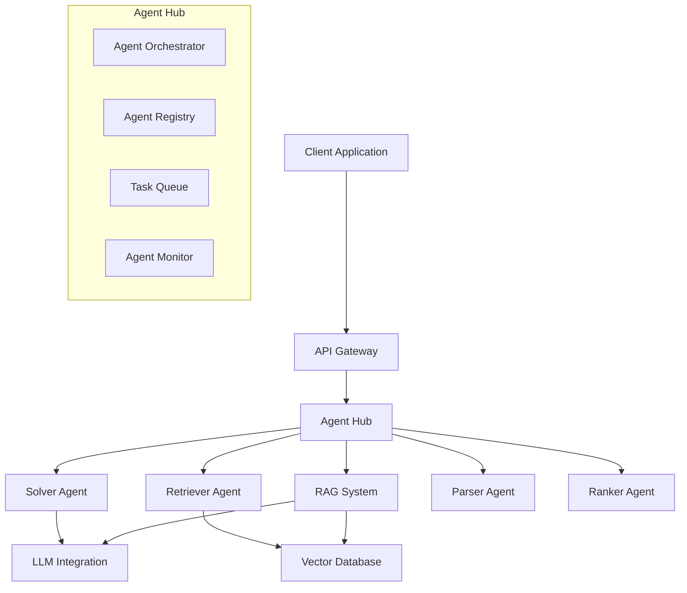

# Agent Hub

This document describes the Agent Hub component of the Loreum Cortex system, which manages the coordination and execution of various AI agents to process queries and perform tasks.

## Overview

The Agent Hub serves as the orchestration layer for AI agents within Loreum Cortex. It routes queries to the appropriate agents, manages their execution, aggregates their responses, and ensures the quality of results. The hub follows a modular design, allowing for the integration of different types of agents with specialized capabilities.



## Key Components

### Agent Registry

Maintains a catalog of available agents, their capabilities, and operational status:

- **Agent registration**: Allows agents to advertise their services
- **Capability matching**: Finds agents capable of handling specific tasks
- **Health monitoring**: Tracks agent availability and performance

```go
// Agent registry implementation
type AgentRegistry struct {
    agents        map[string]*AgentInfo
    capabilities  map[string][]string  // capability -> agent IDs
    lock          sync.RWMutex
}

// Agent information
type AgentInfo struct {
    ID            string
    AgentType     string
    Capabilities  []string
    Status        AgentStatus
    Performance   PerformanceMetrics
    LastSeen      time.Time
    NodeID        peer.ID        // P2P node ID hosting this agent
}

// Register a new agent
func (r *AgentRegistry) RegisterAgent(agent *AgentInfo) error {
    r.lock.Lock()
    defer r.lock.Unlock()
    
    r.agents[agent.ID] = agent
    
    // Update capability index
    for _, capability := range agent.Capabilities {
        r.capabilities[capability] = append(r.capabilities[capability], agent.ID)
    }
    
    return nil
}

// Find agents with a specific capability
func (r *AgentRegistry) FindAgentsByCapability(capability string) []*AgentInfo {
    r.lock.RLock()
    defer r.lock.RUnlock()
    
    agentIDs, exists := r.capabilities[capability]
    if !exists {
        return nil
    }
    
    result := make([]*AgentInfo, 0, len(agentIDs))
    for _, id := range agentIDs {
        if agent, ok := r.agents[id]; ok && agent.Status == AgentStatusActive {
            result = append(result, agent)
        }
    }
    
    return result
}
```

### Agent Orchestrator

Coordinates the execution flow of tasks across multiple agents:

- **Workflow definitions**: Defines sequences of agent operations
- **Task distribution**: Allocates tasks to appropriate agents
- **State management**: Tracks the state of ongoing workflows
- **Error handling**: Manages retries and failure modes

```go
// Agent orchestrator implementation
type AgentOrchestrator struct {
    registry      *AgentRegistry
    workflows     map[string]*Workflow
    taskQueue     *TaskQueue
    stateStore    StateStore
}

// Workflow definition
type Workflow struct {
    ID            string
    Steps         []WorkflowStep
    ErrorHandlers map[string]ErrorHandler
}

// Workflow step
type WorkflowStep struct {
    ID            string
    StepType      string
    Capability    string
    Dependencies  []string
    Config        map[string]interface{}
}

// Execute a workflow
func (o *AgentOrchestrator) ExecuteWorkflow(ctx context.Context, workflowID string, input interface{}) (interface{}, error) {
    workflow, exists := o.workflows[workflowID]
    if !exists {
        return nil, fmt.Errorf("workflow %s not found", workflowID)
    }
    
    // Create execution state
    executionID := uuid.New().String()
    state := &WorkflowState{
        WorkflowID:  workflowID,
        ExecutionID: executionID,
        Status:      WorkflowStatusRunning,
        StepResults: make(map[string]interface{}),
        Input:       input,
    }
    
    // Save initial state
    if err := o.stateStore.SaveState(ctx, state); err != nil {
        return nil, fmt.Errorf("failed to save initial state: %w", err)
    }
    
    // Execute steps in dependency order
    for _, step := range workflow.Steps {
        // Check if dependencies are satisfied
        ready := true
        for _, dep := range step.Dependencies {
            if _, exists := state.StepResults[dep]; !exists {
                ready = false
                break
            }
        }
        
        if !ready {
            continue
        }
        
        // Find an agent for this step
        agents := o.registry.FindAgentsByCapability(step.Capability)
        if len(agents) == 0 {
            state.Status = WorkflowStatusFailed
            state.Error = fmt.Sprintf("no agent found with capability %s", step.Capability)
            o.stateStore.SaveState(ctx, state)
            return nil, errors.New(state.Error)
        }
        
        // Select the best agent (based on performance, load, etc.)
        selectedAgent := o.selectBestAgent(agents)
        
        // Prepare task input
        taskInput := o.prepareTaskInput(state, step)
        
        // Create task
        task := &Task{
            ID:        uuid.New().String(),
            AgentID:   selectedAgent.ID,
            StepID:    step.ID,
            Input:     taskInput,
            Workflow:  workflowID,
            Execution: executionID,
        }
        
        // Submit task
        result, err := o.taskQueue.SubmitAndWait(ctx, task)
        if err != nil {
            // Handle error according to workflow definition
            if handler, exists := workflow.ErrorHandlers[step.ID]; exists {
                handled, handlerResult := handler(ctx, state, err)
                if handled {
                    // Store handler result and continue
                    state.StepResults[step.ID] = handlerResult
                    continue
                }
            }
            
            // Unhandled error
            state.Status = WorkflowStatusFailed
            state.Error = fmt.Sprintf("step %s failed: %v", step.ID, err)
            o.stateStore.SaveState(ctx, state)
            return nil, errors.New(state.Error)
        }
        
        // Store step result
        state.StepResults[step.ID] = result
        o.stateStore.SaveState(ctx, state)
    }
    
    // Workflow completed successfully
    state.Status = WorkflowStatusCompleted
    o.stateStore.SaveState(ctx, state)
    
    // Return final result (from the last step or a designated output step)
    return state.StepResults[workflow.Steps[len(workflow.Steps)-1].ID], nil
}
```

### Task Queue

Manages the queue of pending tasks and their distribution to agents:

- **Priority queuing**: Ensures critical tasks are processed first
- **Load balancing**: Distributes tasks evenly across available agents
- **Deadline management**: Handles task timeouts and cancellations
- **Result collection**: Gathers and routes agent responses

```go
// Task queue implementation
type TaskQueue struct {
    tasks         chan *Task
    results       map[string]chan TaskResult
    lock          sync.RWMutex
}

// Task representation
type Task struct {
    ID            string
    AgentID       string
    StepID        string
    Input         interface{}
    Workflow      string
    Execution     string
    Priority      int
    Deadline      time.Time
}

// Task result
type TaskResult struct {
    TaskID        string
    Result        interface{}
    Error         error
    ExecutionTime time.Duration
}

// Submit a task and wait for its result
func (q *TaskQueue) SubmitAndWait(ctx context.Context, task *Task) (interface{}, error) {
    // Create result channel
    resultCh := make(chan TaskResult, 1)
    
    q.lock.Lock()
    q.results[task.ID] = resultCh
    q.lock.Unlock()
    
    // Submit task
    select {
    case q.tasks <- task:
        // Task submitted successfully
    case <-ctx.Done():
        // Context cancelled
        q.lock.Lock()
        delete(q.results, task.ID)
        q.lock.Unlock()
        return nil, ctx.Err()
    }
    
    // Wait for result
    select {
    case result := <-resultCh:
        return result.Result, result.Error
    case <-ctx.Done():
        return nil, ctx.Err()
    }
}

// Handle task completion
func (q *TaskQueue) CompleteTask(taskID string, result interface{}, err error, execTime time.Duration) {
    q.lock.RLock()
    resultCh, exists := q.results[taskID]
    q.lock.RUnlock()
    
    if exists {
        resultCh <- TaskResult{
            TaskID:        taskID,
            Result:        result,
            Error:         err,
            ExecutionTime: execTime,
        }
        
        q.lock.Lock()
        delete(q.results, taskID)
        q.lock.Unlock()
    }
}
```

### Agent Monitor

Tracks agent performance and health:

- **Performance metrics**: Collects data on response times, success rates, etc.
- **Resource utilization**: Monitors CPU, memory, and network usage
- **Anomaly detection**: Identifies agents behaving abnormally
- **Quality assessment**: Evaluates the quality of agent responses

```go
// Agent monitor implementation
type AgentMonitor struct {
    registry      *AgentRegistry
    metrics       map[string]*AgentMetrics
    lock          sync.RWMutex
    thresholds    MonitorThresholds
}

// Agent metrics
type AgentMetrics struct {
    TasksProcessed    int64
    TasksSucceeded    int64
    TasksFailed       int64
    ResponseTimes     []time.Duration
    AverageResponseTime time.Duration
    LastUpdate        time.Time
}

// Update agent metrics after task completion
func (m *AgentMonitor) RecordTaskCompletion(agentID string, successful bool, responseTime time.Duration) {
    m.lock.Lock()
    defer m.lock.Unlock()
    
    metrics, exists := m.metrics[agentID]
    if !exists {
        metrics = &AgentMetrics{}
        m.metrics[agentID] = metrics
    }
    
    metrics.TasksProcessed++
    if successful {
        metrics.TasksSucceeded++
    } else {
        metrics.TasksFailed++
    }
    
    metrics.ResponseTimes = append(metrics.ResponseTimes, responseTime)
    if len(metrics.ResponseTimes) > 100 {
        metrics.ResponseTimes = metrics.ResponseTimes[len(metrics.ResponseTimes)-100:]
    }
    
    // Calculate average response time
    var total time.Duration
    for _, rt := range metrics.ResponseTimes {
        total += rt
    }
    metrics.AverageResponseTime = total / time.Duration(len(metrics.ResponseTimes))
    metrics.LastUpdate = time.Now()
    
    // Update agent status in registry if needed
    agent := m.registry.GetAgent(agentID)
    if agent != nil {
        if metrics.TasksFailed > metrics.TasksSucceeded*m.thresholds.FailureRatio {
            // Too many failures
            agent.Status = AgentStatusProbation
        } else if metrics.AverageResponseTime > m.thresholds.MaxAverageResponseTime {
            // Too slow
            agent.Status = AgentStatusProbation
        } else {
            agent.Status = AgentStatusActive
        }
        
        m.registry.UpdateAgent(agent)
    }
}
```

## Core Agent Types

### Solver Agent

Processes inference queries using AI models:

- **Model selection**: Chooses the appropriate model for the query
- **Inference execution**: Runs the query through the model
- **Response generation**: Formats the model output for the client
- **Context management**: Manages conversation context for follow-up queries

```go
// Solver agent implementation
type SolverAgent struct {
    models          map[string]Model
    defaultModel    string
    vectorStore     *vector.Store
    contextManager  *ContextManager
}

// Model interface
type Model interface {
    GenerateResponse(ctx context.Context, prompt string, options ModelOptions) (string, error)
    Name() string
    Capabilities() []string
}

// Process a query
func (a *SolverAgent) ProcessQuery(ctx context.Context, query *Query) (*QueryResponse, error) {
    // Determine which model to use
    modelName := a.defaultModel
    if query.ModelPreference != "" && a.models[query.ModelPreference] != nil {
        modelName = query.ModelPreference
    }
    model := a.models[modelName]
    
    // Prepare prompt with context if available
    prompt := query.Query
    if query.ContextID != "" {
        context, err := a.contextManager.GetContext(query.ContextID)
        if err == nil && context != nil {
            prompt = a.buildPromptWithContext(query.Query, context)
        }
    }
    
    // Add RAG context if enabled
    if query.EnableRAG {
        ragContext, err := a.retrieveRelevantContext(query.Query)
        if err == nil && ragContext != "" {
            prompt = a.buildPromptWithRAG(prompt, ragContext)
        }
    }
    
    // Generate response
    startTime := time.Now()
    response, err := model.GenerateResponse(ctx, prompt, query.Options)
    executionTime := time.Since(startTime)
    
    if err != nil {
        return nil, fmt.Errorf("model generation failed: %w", err)
    }
    
    // Update conversation context if needed
    if query.ContextID != "" {
        a.contextManager.UpdateContext(query.ContextID, query.Query, response)
    }
    
    return &QueryResponse{
        Response:      response,
        ModelUsed:     modelName,
        ExecutionTime: executionTime,
    }, nil
}
```

### Retriever Agent

Finds relevant information from various sources:

- **Vector search**: Finds semantically similar content
- **Keyword search**: Supplements with keyword-based retrieval
- **Multi-source integration**: Retrieves data from multiple repositories
- **Content filtering**: Removes irrelevant or low-quality results

```go
// Retriever agent implementation
type RetrieverAgent struct {
    vectorStore     *vector.Store
    sqlStore        *sql.Store
    embeddingModel  *embedding.Model
    maxResults      int
    minRelevance    float64
}

// Retrieve relevant documents
func (a *RetrieverAgent) RetrieveDocuments(ctx context.Context, query string, options RetrievalOptions) ([]Document, error) {
    // Generate embedding for the query
    embedding, err := a.embeddingModel.EmbedQuery(query)
    if err != nil {
        return nil, fmt.Errorf("failed to embed query: %w", err)
    }
    
    // Perform vector search
    maxResults := a.maxResults
    if options.MaxResults > 0 {
        maxResults = options.MaxResults
    }
    
    minRelevance := a.minRelevance
    if options.MinRelevance > 0 {
        minRelevance = options.MinRelevance
    }
    
    vectorResults, err := a.vectorStore.Search(ctx, embedding, maxResults, minRelevance)
    if err != nil {
        return nil, fmt.Errorf("vector search failed: %w", err)
    }
    
    // Convert to documents
    documents := make([]Document, 0, len(vectorResults))
    for _, result := range vectorResults {
        documents = append(documents, Document{
            ID:         result.ID,
            Content:    result.Content,
            Metadata:   result.Metadata,
            Relevance:  result.Score,
            Source:     "vector",
        })
    }
    
    // If keyword search is enabled, supplement results
    if options.EnableKeywordSearch {
        keywordResults, err := a.performKeywordSearch(ctx, query, maxResults)
        if err == nil {
            // Add non-duplicate results
            seenIDs := make(map[string]bool)
            for _, doc := range documents {
                seenIDs[doc.ID] = true
            }
            
            for _, result := range keywordResults {
                if !seenIDs[result.ID] {
                    documents = append(documents, Document{
                        ID:         result.ID,
                        Content:    result.Content,
                        Metadata:   result.Metadata,
                        Relevance:  result.Score,
                        Source:     "keyword",
                    })
                    seenIDs[result.ID] = true
                }
            }
        }
    }
    
    // Sort by relevance
    sort.Slice(documents, func(i, j int) bool {
        return documents[i].Relevance > documents[j].Relevance
    })
    
    return documents, nil
}
```

### Parser Agent

Interprets and structures queries:

- **Intent classification**: Identifies the query intent
- **Entity extraction**: Recognizes entities in the query
- **Query normalization**: Standardizes query format
- **Structure generation**: Converts natural language to structured formats

```go
// Parser agent implementation
type ParserAgent struct {
    intentClassifier *classifier.Model
    entityExtractor  *extractor.Model
    schemas          map[string]QuerySchema
}

// Parse a query
func (a *ParserAgent) ParseQuery(ctx context.Context, rawQuery string) (*ParsedQuery, error) {
    // Classify intent
    intent, confidence := a.intentClassifier.Classify(rawQuery)
    
    // Extract entities
    entities := a.entityExtractor.Extract(rawQuery)
    
    // Normalize query
    normalized := a.normalizeQuery(rawQuery)
    
    // Apply schema if available
    var structured map[string]interface{}
    if schema, exists := a.schemas[intent]; exists {
        structured = schema.ApplyToEntities(entities)
    }
    
    return &ParsedQuery{
        RawQuery:    rawQuery,
        Normalized:  normalized,
        Intent:      intent,
        Confidence:  confidence,
        Entities:    entities,
        Structured:  structured,
    }, nil
}
```

### Ranker Agent

Evaluates and ranks responses:

- **Quality assessment**: Measures response quality
- **Relevance scoring**: Scores response relevance to the query
- **Fact checking**: Verifies factual accuracy when possible
- **Response comparison**: Compares multiple responses to select the best

```go
// Ranker agent implementation
type RankerAgent struct {
    qualityModel    *quality.Model
    relevanceModel  *relevance.Model
    factChecker     *fact.Checker
    weightConfig    RankingWeights
}

// Rank responses
func (a *RankerAgent) RankResponses(ctx context.Context, query string, responses []string) ([]RankedResponse, error) {
    // Create a response array
    ranked := make([]RankedResponse, len(responses))
    
    // Process each response
    for i, response := range responses {
        // Quality score
        quality, err := a.qualityModel.EvaluateQuality(response)
        if err != nil {
            quality = 0.5 // Default score on error
        }
        
        // Relevance score
        relevance, err := a.relevanceModel.EvaluateRelevance(query, response)
        if err != nil {
            relevance = 0.5 // Default score on error
        }
        
        // Fact check if enabled
        factScore := 1.0
        if a.factChecker != nil {
            factScore, _ = a.factChecker.CheckFacts(response)
        }
        
        // Calculate composite score
        compositeScore := (quality * a.weightConfig.Quality) +
                          (relevance * a.weightConfig.Relevance) +
                          (factScore * a.weightConfig.FactualAccuracy)
        
        ranked[i] = RankedResponse{
            Response:      response,
            CompositeScore: compositeScore,
            QualityScore:  quality,
            RelevanceScore: relevance,
            FactScore:     factScore,
        }
    }
    
    // Sort by composite score
    sort.Slice(ranked, func(i, j int) bool {
        return ranked[i].CompositeScore > ranked[j].CompositeScore
    })
    
    return ranked, nil
}
```

## Integration with RAG System

The Agent Hub integrates deeply with the [RAG System](rag-system.md) to enhance responses with contextual information:

- **Query enrichment**: Adds relevant context to queries
- **Dynamic context selection**: Chooses context based on query analysis
- **Source attribution**: Tracks which sources influenced responses
- **Feedback loop**: Improves context selection based on response quality

```go
// RAG integration in the Agent Hub
func (h *AgentHub) enrichQueryWithRAG(ctx context.Context, query *Query) (*Query, error) {
    if !query.EnableRAG {
        return query, nil
    }
    
    // Parse query to understand intent and entities
    parsedQuery, err := h.parseQuery(ctx, query.Query)
    if err != nil {
        logger.Warnf("Failed to parse query for RAG: %v", err)
        return query, nil
    }
    
    // Retrieve relevant documents
    retrievalOptions := RetrievalOptions{
        MaxResults:         10,
        MinRelevance:       0.7,
        EnableKeywordSearch: true,
        Filters:            buildFiltersFromEntities(parsedQuery.Entities),
    }
    
    documents, err := h.retriever.RetrieveDocuments(ctx, query.Query, retrievalOptions)
    if err != nil {
        logger.Warnf("Document retrieval failed: %v", err)
        return query, nil
    }
    
    // Convert documents to context items
    contextItems := make([]ContextItem, 0, len(documents))
    for _, doc := range documents {
        contextItems = append(contextItems, ContextItem{
            Content:   doc.Content,
            Source:    doc.Metadata["source"],
            Timestamp: doc.Metadata["timestamp"],
            Weight:    doc.Relevance,
        })
    }
    
    // Add context items to query
    query.ContextItems = contextItems
    
    return query, nil
}
```

## Integration with P2P Network

The Agent Hub interacts with the [P2P Network](../network/p2p-network.md) to distribute agent workloads across the network:

- **Agent discovery**: Finds agents on remote nodes
- **Distributed execution**: Routes tasks to agents on other nodes
- **Resource sharing**: Shares computational resources across the network
- **Fault tolerance**: Redirects tasks when agents become unavailable

```go
// P2P integration in the Agent Hub
func (h *AgentHub) connectToNetwork(ctx context.Context, node *p2p.Node) error {
    // Subscribe to agent discovery topic
    topic, err := node.JoinTopic("agent-discovery")
    if err != nil {
        return fmt.Errorf("failed to join agent discovery topic: %w", err)
    }
    
    // Start agent discovery service
    go h.discoverRemoteAgents(ctx, topic)
    
    // Advertise local agents
    go h.advertiseLocalAgents(ctx, topic)
    
    // Subscribe to task distribution topic
    taskTopic, err := node.JoinTopic("agent-tasks")
    if err != nil {
        return fmt.Errorf("failed to join task topic: %w", err)
    }
    
    // Start task handler
    go h.handleRemoteTasks(ctx, taskTopic)
    
    return nil
}

// Discover agents on the network
func (h *AgentHub) discoverRemoteAgents(ctx context.Context, topic *pubsub.Topic) {
    subscription, err := topic.Subscribe()
    if err != nil {
        logger.Errorf("Failed to subscribe to agent discovery topic: %v", err)
        return
    }
    
    for {
        msg, err := subscription.Next(ctx)
        if err != nil {
            logger.Warnf("Error receiving discovery message: %v", err)
            continue
        }
        
        // Ignore messages from self
        if msg.ReceivedFrom == h.node.ID() {
            continue
        }
        
        // Decode agent info
        var agentInfo AgentInfo
        if err := json.Unmarshal(msg.Data, &agentInfo); err != nil {
            logger.Warnf("Failed to decode agent info: %v", err)
            continue
        }
        
        // Register remote agent
        agentInfo.NodeID = msg.ReceivedFrom
        h.registry.RegisterAgent(&agentInfo)
        
        logger.Infof("Discovered remote agent: %s on node %s", agentInfo.ID, agentInfo.NodeID)
    }
}

// Advertise local agents to the network
func (h *AgentHub) advertiseLocalAgents(ctx context.Context, topic *pubsub.Topic) {
    ticker := time.NewTicker(5 * time.Minute)
    defer ticker.Stop()
    
    for {
        select {
        case <-ticker.C:
            localAgents := h.registry.GetLocalAgents()
            for _, agent := range localAgents {
                // Remove node ID for advertisement
                advertInfo := *agent
                advertInfo.NodeID = ""
                
                data, err := json.Marshal(advertInfo)
                if err != nil {
                    logger.Warnf("Failed to encode agent info: %v", err)
                    continue
                }
                
                if err := topic.Publish(ctx, data); err != nil {
                    logger.Warnf("Failed to publish agent info: %v", err)
                }
            }
        case <-ctx.Done():
            return
        }
    }
}
```

## Error Handling and Retry Logic

The Agent Hub implements robust error handling and retry mechanisms:

- **Transient failures**: Automatically retries temporary errors
- **Permanent failures**: Routes to fallback agents or error handlers
- **Timeouts**: Enforces deadline constraints on agent operations
- **Circuit breaking**: Prevents cascading failures

```go
// Retry strategy
type RetryStrategy struct {
    MaxAttempts     int
    BackoffFactor   float64
    InitialBackoff  time.Duration
    MaxBackoff      time.Duration
    RetryableErrors []string
}

// Execute an agent task with retries
func (h *AgentHub) executeWithRetry(ctx context.Context, task *Task, strategy RetryStrategy) (interface{}, error) {
    var lastErr error
    backoff := strategy.InitialBackoff
    
    for attempt := 0; attempt < strategy.MaxAttempts; attempt++ {
        // Check if context is cancelled
        if ctx.Err() != nil {
            return nil, ctx.Err()
        }
        
        // Execute task
        result, err := h.executeTask(ctx, task)
        if err == nil {
            return result, nil
        }
        
        lastErr = err
        
        // Check if error is retryable
        retryable := false
        errStr := err.Error()
        for _, retryableErr := range strategy.RetryableErrors {
            if strings.Contains(errStr, retryableErr) {
                retryable = true
                break
            }
        }
        
        if !retryable {
            return nil, err
        }
        
        // Wait before retry
        timer := time.NewTimer(backoff)
        select {
        case <-timer.C:
            // Backoff complete, continue with retry
        case <-ctx.Done():
            timer.Stop()
            return nil, ctx.Err()
        }
        
        // Increase backoff for next attempt
        backoff = time.Duration(float64(backoff) * strategy.BackoffFactor)
        if backoff > strategy.MaxBackoff {
            backoff = strategy.MaxBackoff
        }
    }
    
    return nil, fmt.Errorf("max retry attempts reached: %w", lastErr)
}
```

## Quality Control

To ensure high-quality responses, the Agent Hub implements several quality control mechanisms:

- **Response validation**: Checks responses against quality criteria
- **Ensemble methods**: Combines outputs from multiple agents
- **Confidence thresholds**: Filters low-confidence responses
- **Human feedback integration**: Incorporates feedback into agent selection

```go
// Quality control for responses
func (h *AgentHub) ensureQuality(ctx context.Context, query string, responses []string) (string, error) {
    if len(responses) == 0 {
        return "", errors.New("no responses available for quality control")
    }
    
    // For a single response, apply validation
    if len(responses) == 1 {
        valid, reason := h.validateResponse(responses[0])
        if !valid {
            return "", fmt.Errorf("response failed quality validation: %s", reason)
        }
        return responses[0], nil
    }
    
    // For multiple responses, rank and select the best
    ranked, err := h.ranker.RankResponses(ctx, query, responses)
    if err != nil {
        logger.Warnf("Response ranking failed, using first response: %v", err)
        return responses[0], nil
    }
    
    // Check if the best response meets quality threshold
    if ranked[0].CompositeScore < h.qualityThreshold {
        return "", fmt.Errorf("best response score %.2f below threshold %.2f", 
            ranked[0].CompositeScore, h.qualityThreshold)
    }
    
    return ranked[0].Response, nil
}
```

## Implementation Details

The Agent Hub is implemented using:

```go
// Main Hub structure
type AgentHub struct {
    registry       *AgentRegistry
    orchestrator   *AgentOrchestrator
    taskQueue      *TaskQueue
    monitor        *AgentMonitor
    solver         *SolverAgent
    retriever      *RetrieverAgent
    parser         *ParserAgent
    ranker         *RankerAgent
    node           *p2p.Node
    consensus      *consensus.Service
    qualityThreshold float64
    retryStrategy  RetryStrategy
}

// Initialize a new Agent Hub
func NewAgentHub(config AgentHubConfig, node *p2p.Node, consensusService *consensus.Service) (*AgentHub, error) {
    // Create registry
    registry := &AgentRegistry{
        agents:       make(map[string]*AgentInfo),
        capabilities: make(map[string][]string),
    }
    
    // Create task queue
    taskQueue := &TaskQueue{
        tasks:   make(chan *Task, config.QueueSize),
        results: make(map[string]chan TaskResult),
    }
    
    // Create monitor
    monitor := &AgentMonitor{
        registry:   registry,
        metrics:    make(map[string]*AgentMetrics),
        thresholds: config.MonitorThresholds,
    }
    
    // Create agents
    solver, err := NewSolverAgent(config.SolverConfig)
    if err != nil {
        return nil, fmt.Errorf("failed to create solver agent: %w", err)
    }
    
    retriever, err := NewRetrieverAgent(config.RetrieverConfig)
    if err != nil {
        return nil, fmt.Errorf("failed to create retriever agent: %w", err)
    }
    
    parser, err := NewParserAgent(config.ParserConfig)
    if err != nil {
        return nil, fmt.Errorf("failed to create parser agent: %w", err)
    }
    
    ranker, err := NewRankerAgent(config.RankerConfig)
    if err != nil {
        return nil, fmt.Errorf("failed to create ranker agent: %w", err)
    }
    
    // Create state store
    stateStore, err := NewStateStore(config.StateStoreConfig)
    if err != nil {
        return nil, fmt.Errorf("failed to create state store: %w", err)
    }
    
    // Create orchestrator
    orchestrator := &AgentOrchestrator{
        registry:   registry,
        workflows:  loadWorkflows(config.WorkflowsPath),
        taskQueue:  taskQueue,
        stateStore: stateStore,
    }
    
    hub := &AgentHub{
        registry:         registry,
        orchestrator:     orchestrator,
        taskQueue:        taskQueue,
        monitor:          monitor,
        solver:           solver,
        retriever:        retriever,
        parser:           parser,
        ranker:           ranker,
        node:             node,
        consensus:        consensusService,
        qualityThreshold: config.QualityThreshold,
        retryStrategy:    config.RetryStrategy,
    }
    
    // Register local agents
    registry.RegisterAgent(&AgentInfo{
        ID:           "solver-1",
        AgentType:    "solver",
        Capabilities: solver.Capabilities(),
        Status:       AgentStatusActive,
    })
    
    registry.RegisterAgent(&AgentInfo{
        ID:           "retriever-1",
        AgentType:    "retriever",
        Capabilities: retriever.Capabilities(),
        Status:       AgentStatusActive,
    })
    
    // Connect to P2P network
    if node != nil {
        if err := hub.connectToNetwork(context.Background(), node); err != nil {
            logger.Warnf("Failed to connect to P2P network: %v", err)
        }
    }
    
    // Start task processor
    go hub.processTaskQueue()
    
    return hub, nil
}
```

## Next Steps

- Learn about the [RAG System](rag-system.md) that provides context for agent responses
- Explore the [Sensor Hub](sensor-hub.md) for understanding data collection
- See how the [Storage Services](../data/storage-services.md) persist agent state and results 