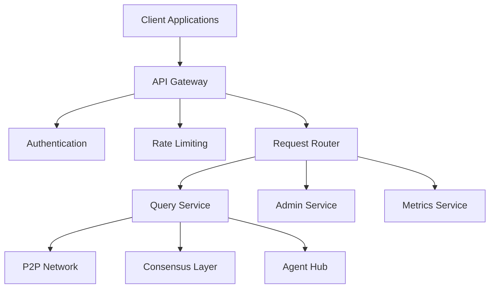

# API Gateway

This document describes the API Gateway component of the Loreum Cortex system, which serves as the entry point for external applications to interact with the decentralized network.

## Overview

The API Gateway provides a unified interface for clients to submit queries, retrieve results, and interact with the Loreum Cortex network. It abstracts the underlying complexity of the decentralized system, presenting a familiar REST and gRPC interface to developers.



## Key Features

### Multiple Protocol Support

The API Gateway supports multiple communication protocols:

- **REST API**: For traditional HTTP-based clients
- **gRPC**: For high-performance, streaming, and bidirectional communication
- **WebSockets**: For real-time updates and notifications

```go
// API Gateway configuration
type GatewayConfig struct {
    RestEnabled      bool
    RestPort         int
    GrpcEnabled      bool
    GrpcPort         int
    WebsocketEnabled bool
    WebsocketPort    int
    AuthEnabled      bool
    RateLimitEnabled bool
    MaxRequestSize   int64
    ReadTimeout      time.Duration
    WriteTimeout     time.Duration
}
```

### Authentication and Authorization

The gateway provides robust authentication options:

- **API Key**: Simple key-based authentication
- **JWT**: For stateless authentication with claims
- **OAuth2**: For integration with identity providers
- **Role-Based Access Control**: For fine-grained permissions

```go
// Authentication middleware
func AuthMiddleware(next http.Handler) http.Handler {
    return http.HandlerFunc(func(w http.ResponseWriter, r *http.Request) {
        // Extract authentication information
        authHeader := r.Header.Get("Authorization")
        if authHeader == "" {
            http.Error(w, "Authorization header required", http.StatusUnauthorized)
            return
        }

        // Parse authentication token
        token, err := parseAuthToken(authHeader)
        if err != nil {
            http.Error(w, "Invalid authentication token", http.StatusUnauthorized)
            return
        }

        // Validate token
        if !validateToken(token) {
            http.Error(w, "Authentication failed", http.StatusUnauthorized)
            return
        }

        // Add user context
        ctx := addUserToContext(r.Context(), token.UserID, token.Roles)
        next.ServeHTTP(w, r.WithContext(ctx))
    })
}
```

### Rate Limiting and Quotas

To ensure fair usage and prevent abuse, the gateway implements:

- **Rate limiting**: Restricts the number of requests per time period
- **Resource quotas**: Limits usage of computational resources
- **Fair queuing**: Ensures equal access during high load

```go
// Rate limiter implementation
type RateLimiter struct {
    store      redis.Client
    windowSize time.Duration
    maxRequests int
}

// Check if a request is allowed under rate limits
func (r *RateLimiter) IsAllowed(userID string) (bool, error) {
    key := fmt.Sprintf("ratelimit:%s:%d", userID, time.Now().Unix()/int64(r.windowSize.Seconds()))
    
    count, err := r.store.Incr(key)
    if err != nil {
        return false, fmt.Errorf("failed to increment counter: %w", err)
    }
    
    // Set expiration for automatic cleanup
    if count == 1 {
        r.store.Expire(key, r.windowSize*2)
    }
    
    return count <= r.maxRequests, nil
}
```

### Request Routing

The gateway routes incoming requests to the appropriate internal services:

- **Path-based routing**: Routes based on URL path
- **Content-based routing**: Routes based on request content
- **Versioned API**: Supports multiple API versions simultaneously

```go
// Router initialization
func setupRouter(services *Services) *mux.Router {
    router := mux.NewRouter()
    
    // API versioning
    apiV1 := router.PathPrefix("/api/v1").Subrouter()
    
    // Query endpoints
    apiV1.HandleFunc("/query", services.QueryHandler).Methods("POST")
    apiV1.HandleFunc("/query/{id}", services.QueryStatusHandler).Methods("GET")
    apiV1.HandleFunc("/query/{id}/result", services.QueryResultHandler).Methods("GET")
    
    // Admin endpoints with additional authentication
    admin := apiV1.PathPrefix("/admin").Subrouter()
    admin.Use(AdminAuthMiddleware)
    admin.HandleFunc("/config", services.ConfigHandler).Methods("GET", "PUT")
    admin.HandleFunc("/nodes", services.NodesHandler).Methods("GET")
    
    // Metrics endpoints
    apiV1.HandleFunc("/metrics", services.MetricsHandler).Methods("GET")
    
    return router
}
```

### Request Validation

All incoming requests are validated for:

- **Schema compliance**: Ensures requests match the expected format
- **Data types**: Validates that field types are correct
- **Required fields**: Checks that all necessary fields are present
- **Business rules**: Applies domain-specific validation rules

```go
// Query request validation
func validateQueryRequest(req *QueryRequest) error {
    // Check required fields
    if req.Query == "" {
        return errors.New("query is required")
    }
    
    // Validate query length
    if len(req.Query) > MaxQueryLength {
        return fmt.Errorf("query exceeds maximum length of %d characters", MaxQueryLength)
    }
    
    // Validate context items
    for i, item := range req.ContextItems {
        if item.Content == "" {
            return fmt.Errorf("context item %d has empty content", i)
        }
        
        if len(item.Content) > MaxContextItemLength {
            return fmt.Errorf("context item %d exceeds maximum length", i)
        }
    }
    
    return nil
}
```

### Response Formatting

The gateway formats responses according to client needs:

- **Content negotiation**: Supports JSON, XML, and other formats
- **Pagination**: For large result sets
- **Field filtering**: Returns only requested fields
- **Compression**: Reduces response size for network efficiency

## API Endpoints

### Query API

The core functionality for interacting with the Loreum Cortex system:

| Endpoint | Method | Description |
|----------|--------|-------------|
| `/api/v1/query` | POST | Submit a new query to the network |
| `/api/v1/query/{id}` | GET | Get the status of a submitted query |
| `/api/v1/query/{id}/result` | GET | Get the result of a completed query |
| `/api/v1/query/stream` | WebSocket | Stream query updates in real-time |

```go
// Query request structure
type QueryRequest struct {
    Query        string          `json:"query"`
    ContextItems []ContextItem   `json:"contextItems,omitempty"`
    Options      QueryOptions    `json:"options,omitempty"`
    Timeout      time.Duration   `json:"timeout,omitempty"`
}

// Context item for RAG
type ContextItem struct {
    Content     string `json:"content"`
    Source      string `json:"source,omitempty"`
    Timestamp   string `json:"timestamp,omitempty"`
    Weight      float64 `json:"weight,omitempty"`
}

// Query response structure
type QueryResponse struct {
    ID          string    `json:"id"`
    Status      string    `json:"status"`
    Result      string    `json:"result,omitempty"`
    CreatedAt   time.Time `json:"createdAt"`
    CompletedAt time.Time `json:"completedAt,omitempty"`
    Error       string    `json:"error,omitempty"`
}
```

### Admin API

For system management and configuration:

| Endpoint | Method | Description |
|----------|--------|-------------|
| `/api/v1/admin/config` | GET | Get current node configuration |
| `/api/v1/admin/config` | PUT | Update node configuration |
| `/api/v1/admin/nodes` | GET | List known nodes in the network |
| `/api/v1/admin/peers` | GET | Get detailed peer information |

### Metrics API

For monitoring system performance:

| Endpoint | Method | Description |
|----------|--------|-------------|
| `/api/v1/metrics` | GET | Get node performance metrics |
| `/api/v1/metrics/query` | GET | Get query-related metrics |
| `/api/v1/metrics/network` | GET | Get network-related metrics |
| `/api/v1/metrics/resources` | GET | Get resource usage metrics |

## Error Handling

The API Gateway implements standardized error handling:

- **HTTP status codes**: For indicating the nature of errors
- **Detailed error messages**: To help diagnose issues
- **Error codes**: For programmatic error handling
- **Correlation IDs**: To track requests across the system

```go
// Error response structure
type ErrorResponse struct {
    Status       int    `json:"status"`
    Code         string `json:"code"`
    Message      string `json:"message"`
    Details      string `json:"details,omitempty"`
    CorrelationID string `json:"correlationId"`
}

// Error handler function
func SendErrorResponse(w http.ResponseWriter, status int, code, message, details string, correlationID string) {
    response := ErrorResponse{
        Status:       status,
        Code:         code,
        Message:      message,
        Details:      details,
        CorrelationID: correlationID,
    }
    
    w.Header().Set("Content-Type", "application/json")
    w.WriteHeader(status)
    
    if err := json.NewEncoder(w).Encode(response); err != nil {
        log.Printf("Failed to encode error response: %v", err)
    }
}
```

## Load Balancing

For high-availability deployments, the gateway supports:

- **Multiple instances**: To handle high traffic loads
- **Load balancing**: To distribute requests across instances
- **Health checks**: To route around unhealthy instances
- **Circuit breaking**: To prevent cascading failures

```go
// Health check handler
func HealthCheckHandler(w http.ResponseWriter, r *http.Request) {
    // Check core services
    services := []string{"consensus", "p2p", "storage"}
    
    // Check each service
    unhealthy := []string{}
    for _, service := range services {
        if !isServiceHealthy(service) {
            unhealthy = append(unhealthy, service)
        }
    }
    
    // Respond based on health status
    if len(unhealthy) == 0 {
        w.WriteHeader(http.StatusOK)
        json.NewEncoder(w).Encode(map[string]string{
            "status": "healthy",
        })
    } else {
        w.WriteHeader(http.StatusServiceUnavailable)
        json.NewEncoder(w).Encode(map[string]interface{}{
            "status": "unhealthy",
            "unhealthyServices": unhealthy,
        })
    }
}
```

## Integration with Other Components

### P2P Network Integration

The gateway connects to the [P2P Network](p2p-network.md) to:

- Forward queries to the network
- Retrieve results from the network
- Monitor network status

### Consensus Integration

The gateway interfaces with the [DAG-aBFT Consensus](dag-abft-consensus.md) to:

- Submit transactions to the consensus layer
- Check transaction status
- Retrieve finalized results

### Agent Hub Integration

The gateway works with the [Agent Hub](../business/agent-hub.md) to:

- Route queries to appropriate agents
- Monitor agent processing
- Return agent results to clients

## Implementation Details

The API Gateway is implemented using:

```go
// Main Gateway structure
type Gateway struct {
    config      GatewayConfig
    httpServer  *http.Server
    grpcServer  *grpc.Server
    wsServer    *websocket.Server
    p2pNode     *p2p.Node
    consensus   *consensus.Service
    agentHub    *agent.Hub
    rateLimiter *RateLimiter
    authService *auth.Service
    metrics     *metrics.Service
}

// Initialize a new gateway
func NewGateway(config GatewayConfig, node *p2p.Node, consensusService *consensus.Service, agentHub *agent.Hub) (*Gateway, error) {
    // Initialize components
    rateLimiter, err := NewRateLimiter(config.RateLimitConfig)
    if err != nil {
        return nil, fmt.Errorf("failed to create rate limiter: %w", err)
    }
    
    authService, err := auth.NewService(config.AuthConfig)
    if err != nil {
        return nil, fmt.Errorf("failed to create auth service: %w", err)
    }
    
    metricsService := metrics.NewService()
    
    // Create services for handlers
    services := &Services{
        P2PNode:     node,
        Consensus:   consensusService,
        AgentHub:    agentHub,
        RateLimiter: rateLimiter,
        AuthService: authService,
        Metrics:     metricsService,
    }
    
    // Set up the router
    router := setupRouter(services)
    
    // Create HTTP server
    httpServer := &http.Server{
        Addr:         fmt.Sprintf(":%d", config.RestPort),
        Handler:      router,
        ReadTimeout:  config.ReadTimeout,
        WriteTimeout: config.WriteTimeout,
        IdleTimeout:  120 * time.Second,
    }
    
    // Create gRPC server if enabled
    var grpcServer *grpc.Server
    if config.GrpcEnabled {
        grpcServer = grpc.NewServer(
            grpc.UnaryInterceptor(grpcMiddleware),
        )
        pb.RegisterQueryServiceServer(grpcServer, services)
    }
    
    // Create WebSocket server if enabled
    var wsServer *websocket.Server
    if config.WebsocketEnabled {
        wsServer = websocket.NewServer(services)
    }
    
    gateway := &Gateway{
        config:      config,
        httpServer:  httpServer,
        grpcServer:  grpcServer,
        wsServer:    wsServer,
        p2pNode:     node,
        consensus:   consensusService,
        agentHub:    agentHub,
        rateLimiter: rateLimiter,
        authService: authService,
        metrics:     metricsService,
    }
    
    return gateway, nil
}

// Start the gateway
func (g *Gateway) Start() error {
    // Start HTTP server
    if g.config.RestEnabled {
        go func() {
            log.Printf("Starting HTTP server on port %d", g.config.RestPort)
            if err := g.httpServer.ListenAndServe(); err != nil && err != http.ErrServerClosed {
                log.Fatalf("HTTP server error: %v", err)
            }
        }()
    }
    
    // Start gRPC server
    if g.config.GrpcEnabled {
        go func() {
            addr := fmt.Sprintf(":%d", g.config.GrpcPort)
            lis, err := net.Listen("tcp", addr)
            if err != nil {
                log.Fatalf("Failed to listen on %s: %v", addr, err)
            }
            log.Printf("Starting gRPC server on port %d", g.config.GrpcPort)
            if err := g.grpcServer.Serve(lis); err != nil {
                log.Fatalf("gRPC server error: %v", err)
            }
        }()
    }
    
    // Start WebSocket server
    if g.config.WebsocketEnabled {
        go func() {
            log.Printf("Starting WebSocket server on port %d", g.config.WebsocketPort)
            if err := g.wsServer.Start(g.config.WebsocketPort); err != nil {
                log.Fatalf("WebSocket server error: %v", err)
            }
        }()
    }
    
    return nil
}
```

## Next Steps

- Learn about the [Agent Hub](../business/agent-hub.md) that processes queries
- Explore the [RAG System](../business/rag-system.md) for understanding context retrieval
- See how the [Storage Services](../data/storage-services.md) persist query data 