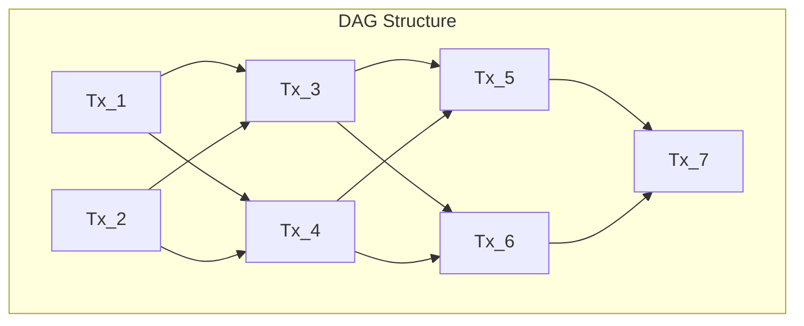
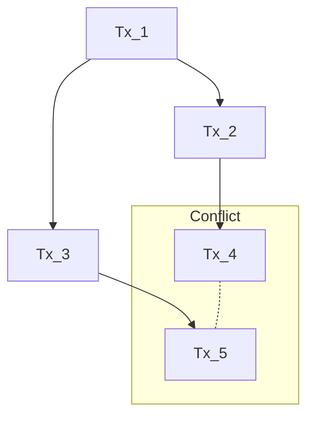

# DAG-aBFT Consensus

This document describes the Directed Acyclic Graph-based asynchronous Byzantine Fault Tolerance (DAG-aBFT) consensus mechanism used in the Loreum Cortex system to achieve agreement on the state of the network.

## Overview

The DAG-aBFT consensus is designed to provide:

- **Asynchronous operation**: Functions correctly without timing assumptions
- **Byzantine fault tolerance**: Tolerates malicious or faulty nodes (up to 1/3 of the network)
- **Scalability**: Enables high throughput and parallelism
- **Finality**: Provides certainty on transaction finality
- **Energy efficiency**: Uses minimal computational resources compared to Proof-of-Work



## DAG Structure

### Transactions as Vertices

In the DAG structure, each transaction is represented as a vertex:

```go
// Transaction representation in the DAG
type Transaction struct {
    ID           hash.Hash       // Hash of the transaction content
    ParentIDs    []hash.Hash     // Hashes of parent transactions
    Timestamp    time.Time       // Time when transaction was created
    Creator      peer.ID         // ID of the node that created the transaction
    Signature    []byte          // Creator's signature
    Payload      []byte          // Transaction data
    Height       uint64          // Height in the DAG (max height of parents + 1)
}
```

### Parent-Child Relationships

Each transaction references one or more previous transactions as its parents, creating a partially ordered structure:

- A transaction's **height** is one more than the maximum height of its parents
- A transaction can reference multiple parents from different branches
- Parents must exist before a transaction can be created

## Consensus Process

The consensus process consists of several key components:

### Transaction Creation

When a node wants to add a transaction to the DAG:

1. It selects a set of parent transactions (tips of the DAG)
2. It creates a new transaction referencing those parents
3. It signs the transaction with its private key
4. It broadcasts the transaction to the network

```go
// Create a new transaction
func (c *Consensus) CreateTransaction(payload []byte) (*Transaction, error) {
    parents, err := c.selectParents()
    if err != nil {
        return nil, fmt.Errorf("failed to select parents: %w", err)
    }
    
    parentIDs := make([]hash.Hash, len(parents))
    maxHeight := uint64(0)
    for i, parent := range parents {
        parentIDs[i] = parent.ID
        if parent.Height > maxHeight {
            maxHeight = parent.Height
        }
    }
    
    tx := &Transaction{
        ParentIDs: parentIDs,
        Timestamp: time.Now(),
        Creator:   c.nodeID,
        Payload:   payload,
        Height:    maxHeight + 1,
    }
    
    // Calculate transaction ID (hash of its content)
    txBytes, err := tx.Bytes()
    if err != nil {
        return nil, fmt.Errorf("failed to serialize transaction: %w", err)
    }
    tx.ID = hash.Sum(txBytes)
    
    // Sign the transaction
    signature, err := c.privateKey.Sign(txBytes)
    if err != nil {
        return nil, fmt.Errorf("failed to sign transaction: %w", err)
    }
    tx.Signature = signature
    
    return tx, nil
}
```

### Transaction Validation

When a node receives a transaction, it validates it by checking:

1. The transaction's structure and signature
2. That all parent transactions exist
3. That the transaction doesn't violate any rules

```go
// Validate a transaction
func (c *Consensus) ValidateTransaction(tx *Transaction) error {
    // Verify structure
    if tx.ID == nil || len(tx.ParentIDs) == 0 || tx.Creator == "" {
        return errors.New("malformed transaction")
    }
    
    // Verify signature
    txBytes, err := tx.BytesWithoutSignature()
    if err != nil {
        return fmt.Errorf("failed to serialize transaction: %w", err)
    }
    
    pubKey, err := c.getPeerPublicKey(tx.Creator)
    if err != nil {
        return fmt.Errorf("failed to get creator's public key: %w", err)
    }
    
    valid, err := pubKey.Verify(txBytes, tx.Signature)
    if err || !valid {
        return errors.New("invalid signature")
    }
    
    // Verify parents exist
    for _, parentID := range tx.ParentIDs {
        if !c.dag.HasTransaction(parentID) {
            return fmt.Errorf("parent transaction %s not found", parentID)
        }
    }
    
    // Verify height is correct
    maxParentHeight := uint64(0)
    for _, parentID := range tx.ParentIDs {
        parent, _ := c.dag.GetTransaction(parentID)
        if parent.Height > maxParentHeight {
            maxParentHeight = parent.Height
        }
    }
    
    if tx.Height != maxParentHeight+1 {
        return errors.New("invalid height")
    }
    
    return nil
}
```

### Transaction Propagation

Validated transactions are propagated through the network using a gossip protocol:

1. Nodes broadcast new transactions to their peers
2. Peers validate and forward transactions to their peers
3. The process continues until the transaction reaches the entire network

### Finality Determination

To determine when a transaction is finalized (cannot be reversed):

1. The system uses a "virtual voting" mechanism based on the DAG structure
2. A transaction is considered finalized when it is referenced (directly or indirectly) by a sufficient number of newer transactions from different nodes
3. The specific threshold depends on network parameters but typically requires 2/3 of honest nodes to confirm

```go
// Check if a transaction is finalized
func (c *Consensus) IsFinalized(txID hash.Hash) (bool, error) {
    tx, err := c.dag.GetTransaction(txID)
    if err != nil {
        return false, fmt.Errorf("transaction not found: %w", err)
    }
    
    // Get all transactions that reference this one (directly or indirectly)
    descendants := c.dag.GetDescendants(txID)
    
    // Count how many unique nodes have confirmed this transaction
    confirmedBy := make(map[peer.ID]bool)
    for _, desc := range descendants {
        confirmedBy[desc.Creator] = true
    }
    
    // Transaction is finalized if at least 2f+1 nodes have confirmed it
    // where f is the maximum number of Byzantine nodes (1/3 of total)
    requiredConfirmations := (2 * c.totalNodes / 3) + 1
    return len(confirmedBy) >= requiredConfirmations, nil
}
```

## Conflict Resolution

### Fork Detection

The DAG structure allows for temporary forks where different branches may contain conflicting transactions:



Conflicts are detected by comparing transactions with the same dependencies or affecting the same state.

### Fork Choice Rule

When conflicts occur, the system uses a fork choice rule to determine which branch to favor:

1. **Main criteria**: Branch with more support (more unique creators)
2. **Tiebreaker 1**: Branch with higher cumulative weight
3. **Tiebreaker 2**: Branch with lexicographically smaller hash

```go
// Resolve a conflict between two branches
func (c *Consensus) ResolveFork(branch1 []hash.Hash, branch2 []hash.Hash) ([]hash.Hash, error) {
    support1 := c.calculateBranchSupport(branch1)
    support2 := c.calculateBranchSupport(branch2)
    
    // Compare by number of unique creators supporting each branch
    if len(support1) > len(support2) {
        return branch1, nil
    }
    if len(support2) > len(support1) {
        return branch2, nil
    }
    
    // Tiebreak by cumulative weight
    weight1 := c.calculateBranchWeight(branch1)
    weight2 := c.calculateBranchWeight(branch2)
    
    if weight1 > weight2 {
        return branch1, nil
    }
    if weight2 > weight1 {
        return branch2, nil
    }
    
    // Final tiebreak by hash
    lastTx1, _ := c.dag.GetTransaction(branch1[len(branch1)-1])
    lastTx2, _ := c.dag.GetTransaction(branch2[len(branch2)-1])
    
    if bytes.Compare(lastTx1.ID[:], lastTx2.ID[:]) < 0 {
        return branch1, nil
    }
    return branch2, nil
}
```

## Performance Optimizations

### Parallel Processing

The DAG structure enables parallel processing of transactions:

- Multiple transactions can be added simultaneously
- Non-conflicting transactions can be processed in parallel
- Different branches can evolve independently

### Leaderless Operation

Unlike leader-based protocols, DAG-aBFT is leaderless:

- No leader election is required
- No bottleneck at a single node
- Better resilience to node failures

### Adaptive Throughput

The system adapts to network conditions:

- In good network conditions, throughput increases
- During network partitions, each partition continues to operate
- Upon reconnection, partitions reconcile their DAGs

## Integration with Other Components

### P2P Network Integration

The consensus mechanism relies on the [P2P Network](p2p-network.md) for:

- Transaction propagation
- Peer discovery
- Network health monitoring

### Agent Hub Integration

The consensus mechanism interfaces with the [Agent Hub](../business/agent-hub.md) for:

- Processing transactions that involve agent operations
- Ensuring consistency of agent state across the network

### Storage System Integration

The consensus layer works with the [Storage Services](../data/storage-services.md) to:

- Persist the DAG structure
- Store finalized transactions
- Provide efficient access to the transaction history

## Security Considerations

### Sybil Attack Mitigation

The system prevents Sybil attacks through:

- Reputation-based weighting of nodes
- Resource commitment requirements
- Economic incentives

### Eclipse Attack Prevention

To prevent eclipse attacks (isolating a node from honest peers):

- Nodes maintain connections to a diverse set of peers
- Connection attempts are randomized
- Peer rotation is performed periodically

### Long-Range Attack Defense

Long-range attacks are mitigated by:

- Social consensus on checkpoints
- State snapshots with cryptographic proofs
- Limitations on chain reorganizations

## Implementation Details

The DAG-aBFT consensus is implemented using:

```go
// Primary Consensus service
type Consensus struct {
    dag           *DAG             // The directed acyclic graph
    nodeID        peer.ID          // This node's ID
    privateKey    crypto.PrivKey   // This node's private key
    peerStore     peerstore.Peerstore // Information about peers
    pubSub        *pubsub.PubSub   // PubSub for transaction propagation
    totalNodes    int              // Estimated total nodes in the network
    // Other fields...
}

// DAG implementation
type DAG struct {
    transactions     map[hash.Hash]*Transaction
    tips             map[hash.Hash]bool     // Transactions with no children
    heights          map[uint64][]hash.Hash // Transactions by height
    lock             sync.RWMutex
    storage          Storage                // Interface to persistent storage
}

// Initialize the consensus service
func NewConsensus(ctx context.Context, host host.Host, ps *pubsub.PubSub, storage Storage) (*Consensus, error) {
    nodeID := host.ID()
    privateKey := host.Peerstore().PrivKey(nodeID)
    
    dag, err := NewDAG(storage)
    if err != nil {
        return nil, fmt.Errorf("failed to create DAG: %w", err)
    }
    
    consensus := &Consensus{
        dag:        dag,
        nodeID:     nodeID,
        privateKey: privateKey,
        peerStore:  host.Peerstore(),
        pubSub:     ps,
        totalNodes: 10, // Initial estimate, will be updated
    }
    
    // Subscribe to transaction topic
    topic, err := ps.Join("transactions")
    if err != nil {
        return nil, fmt.Errorf("failed to join topic: %w", err)
    }
    
    sub, err := topic.Subscribe()
    if err != nil {
        return nil, fmt.Errorf("failed to subscribe: %w", err)
    }
    
    // Start processing transactions
    go consensus.processTransactions(ctx, sub)
    
    return consensus, nil
}
```

## Next Steps

- Learn about the [API Gateway](api-gateway.md) that interfaces with the consensus layer
- Explore how the [Agent Hub](../business/agent-hub.md) processes queries using the consensus
- See the [RAG System](../business/rag-system.md) for understanding how data is organized and retrieved 