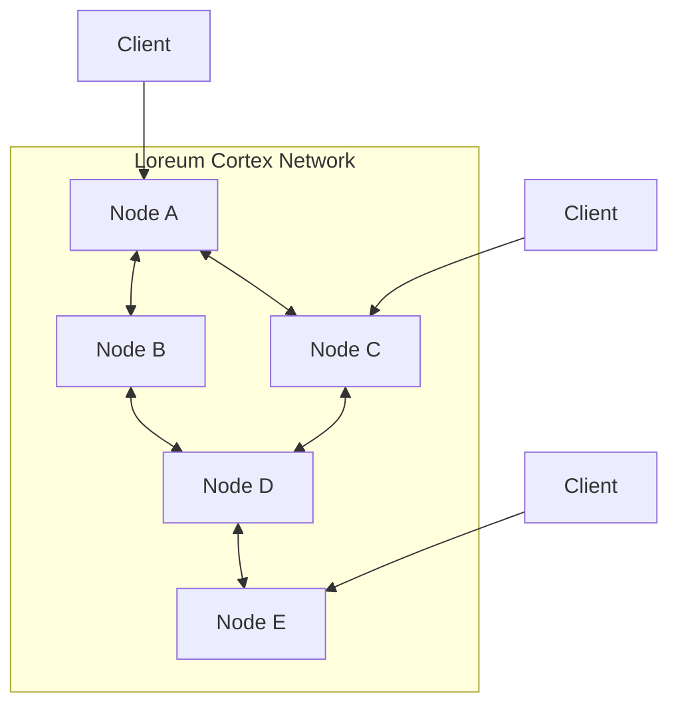

# P2P Network

This document describes the peer-to-peer (P2P) network that forms the foundation of the Loreum Cortex system. The P2P network enables decentralized communication, data sharing, and consensus among nodes.

## Network Architecture

Loreum Cortex uses a structured P2P network based on the libp2p framework, which provides a modular and flexible networking stack.



## Key Components

### Node Identity

Each node in the network has a unique identity represented by:

- A public/private key pair for cryptographic operations
- A Peer ID derived from the public key
- Optional metadata such as geographic location and capabilities

```go
// Node identity representation
type NodeIdentity struct {
    PeerID    peer.ID
    PublicKey crypto.PublicKey
    Metadata  map[string]string
}
```

### Connection Management

Nodes establish secure connections with peers using:

- Transport protocols (TCP, WebSockets, QUIC)
- Security protocols (TLS, Noise)
- Multiplexing protocols (YAMUX, MPLEX)

```go
// Connection options configuration
type ConnectionConfig struct {
    EnabledTransports  []string // e.g., "tcp", "ws", "quic"
    SecurityProtocol   string   // e.g., "tls", "noise"
    MultiplexProtocol  string   // e.g., "yamux", "mplex"
    ConnectionTimeout  time.Duration
    MaxConnections     int
}
```

### Peer Discovery

Nodes discover peers through multiple mechanisms:

1. **Bootstrap Nodes**: Well-known nodes that help with initial network connection
2. **DHT-based Discovery**: Using a Distributed Hash Table for peer lookup
3. **mDNS**: Local network discovery
4. **Peer Exchange**: Exchanging known peers with existing connections

```go
// Discovery service implementation
func (n *Node) SetupDiscovery(ctx context.Context, bootstrapPeers []peer.AddrInfo) error {
    // Setup DHT for peer discovery
    dht, err := dht.New(ctx, n.host)
    if err != nil {
        return fmt.Errorf("failed to create DHT: %w", err)
    }
    
    // Connect to bootstrap peers
    for _, peerInfo := range bootstrapPeers {
        if err := n.host.Connect(ctx, peerInfo); err != nil {
            logger.Warnf("Failed to connect to bootstrap peer %s: %v", peerInfo.ID, err)
        }
    }
    
    // Advertise and find peers
    discovery.Advertise(ctx, dht, n.discoveryNamespace)
    
    return nil
}
```

### Peer Routing

The network uses a DHT-based routing system to efficiently locate peers and content:

- Key-based routing allows finding peers responsible for specific data
- Prefix-based routing improves efficiency for related content
- Caching of routing information reduces lookup latency

### Message Propagation

Messages are propagated through the network using:

1. **PubSub**: Topic-based publish-subscribe for broadcast communication
2. **Direct Messaging**: For node-to-node communication
3. **Gossip Protocol**: For efficient network-wide dissemination

```go
// Setting up PubSub
func (n *Node) SetupPubSub(ctx context.Context) error {
    // Create a new PubSub service using the GossipSub router
    pubsub, err := pubsub.NewGossipSub(ctx, n.host)
    if err != nil {
        return fmt.Errorf("failed to create pubsub: %w", err)
    }
    
    // Join the main topic
    topic, err := pubsub.Join(n.mainTopic)
    if err != nil {
        return fmt.Errorf("failed to join topic: %w", err)
    }
    
    // Subscribe to the topic
    subscription, err := topic.Subscribe()
    if err != nil {
        return fmt.Errorf("failed to subscribe to topic: %w", err)
    }
    
    // Handle incoming messages
    go n.handleMessages(subscription)
    
    n.pubsub = pubsub
    n.mainTopicHandler = topic
    
    return nil
}
```

## Network Security

The P2P network implements several security measures:

### Authentication and Encryption

- All peer connections are authenticated using public key cryptography
- All communication is encrypted using TLS or Noise protocols
- Message signing ensures data integrity and non-repudiation

### Peer Reputation

Nodes maintain reputation scores for peers based on:

- Response time and reliability
- Message validity
- Resource sharing behavior

```go
// Peer reputation tracking
type PeerReputation struct {
    PeerID           peer.ID
    SuccessfulConns  int64
    FailedConns      int64
    ResponseTimes    []time.Duration
    LastSeen         time.Time
    ValidationErrors int64
    ReputationScore  float64
}

// Update peer reputation after an interaction
func (n *Node) UpdatePeerReputation(peerID peer.ID, successful bool, responseTime time.Duration) {
    n.reputationLock.Lock()
    defer n.reputationLock.Unlock()
    
    rep, exists := n.peerReputations[peerID]
    if !exists {
        rep = &PeerReputation{PeerID: peerID}
        n.peerReputations[peerID] = rep
    }
    
    rep.LastSeen = time.Now()
    
    if successful {
        rep.SuccessfulConns++
        rep.ResponseTimes = append(rep.ResponseTimes, responseTime)
        // Keep only the last 100 response times
        if len(rep.ResponseTimes) > 100 {
            rep.ResponseTimes = rep.ResponseTimes[len(rep.ResponseTimes)-100:]
        }
    } else {
        rep.FailedConns++
    }
    
    // Recalculate reputation score
    rep.ReputationScore = calculateReputationScore(rep)
}
```

### Access Control

- Resource limits prevent denial-of-service attacks
- Connection filtering blocks known malicious peers
- IP-based rate limiting prevents spam

## Network Performance

The P2P network is optimized for:

- Low latency for query processing
- High throughput for data propagation
- Scalability as the network grows

Performance optimizations include:

- Connection pooling
- Message batching
- Efficient routing algorithms
- Adaptive peer selection

## Integration Points

The P2P network integrates with other system components:

- **API Gateway**: Exposes network functionality to external clients
- **Consensus Service**: Uses the network for transaction propagation
- **Agent Hub**: Distributes computation across the network
- **Storage Services**: Enables distributed data storage

## Implementation Details

The P2P network implementation is based on:

- [libp2p](https://libp2p.io/) for core networking
- Custom protocols for Loreum-specific functionality
- Robust error handling and recovery mechanisms

```go
// Sample Node implementation
type Node struct {
    ctx               context.Context
    host              host.Host
    dht               *dht.IpfsDHT
    pubsub            *pubsub.PubSub
    mainTopic         string
    mainTopicHandler  *pubsub.Topic
    peerReputations   map[peer.ID]*PeerReputation
    reputationLock    sync.RWMutex
    discoveryNamespace string
    // Other fields...
}

// Initialize a new node
func NewNode(ctx context.Context, listenAddrs []multiaddr.Multiaddr, options ...Option) (*Node, error) {
    // Generate a new identity
    priv, _, err := crypto.GenerateKeyPair(crypto.Ed25519, -1)
    if err != nil {
        return nil, fmt.Errorf("failed to generate key pair: %w", err)
    }
    
    // Apply options
    cfg := defaultConfig()
    for _, opt := range options {
        opt(cfg)
    }
    
    // Create a new libp2p host
    host, err := libp2p.New(
        libp2p.ListenAddrs(listenAddrs...),
        libp2p.Identity(priv),
        libp2p.EnableNATService(),
        libp2p.EnableRelay(),
        libp2p.EnableAutoRelay(),
    )
    if err != nil {
        return nil, fmt.Errorf("failed to create host: %w", err)
    }
    
    // Create a new node
    node := &Node{
        ctx:               ctx,
        host:              host,
        mainTopic:         cfg.MainTopic,
        discoveryNamespace: cfg.DiscoveryNamespace,
        peerReputations:   make(map[peer.ID]*PeerReputation),
    }
    
    return node, nil
}
```

## Next Steps

- Learn about the [DAG-aBFT Consensus](dag-abft-consensus.md) built on top of the P2P network
- Explore the [API Gateway](api-gateway.md) that interfaces with the P2P network
- See how the [Agent Hub](../business/agent-hub.md) utilizes the network for distributed processing 