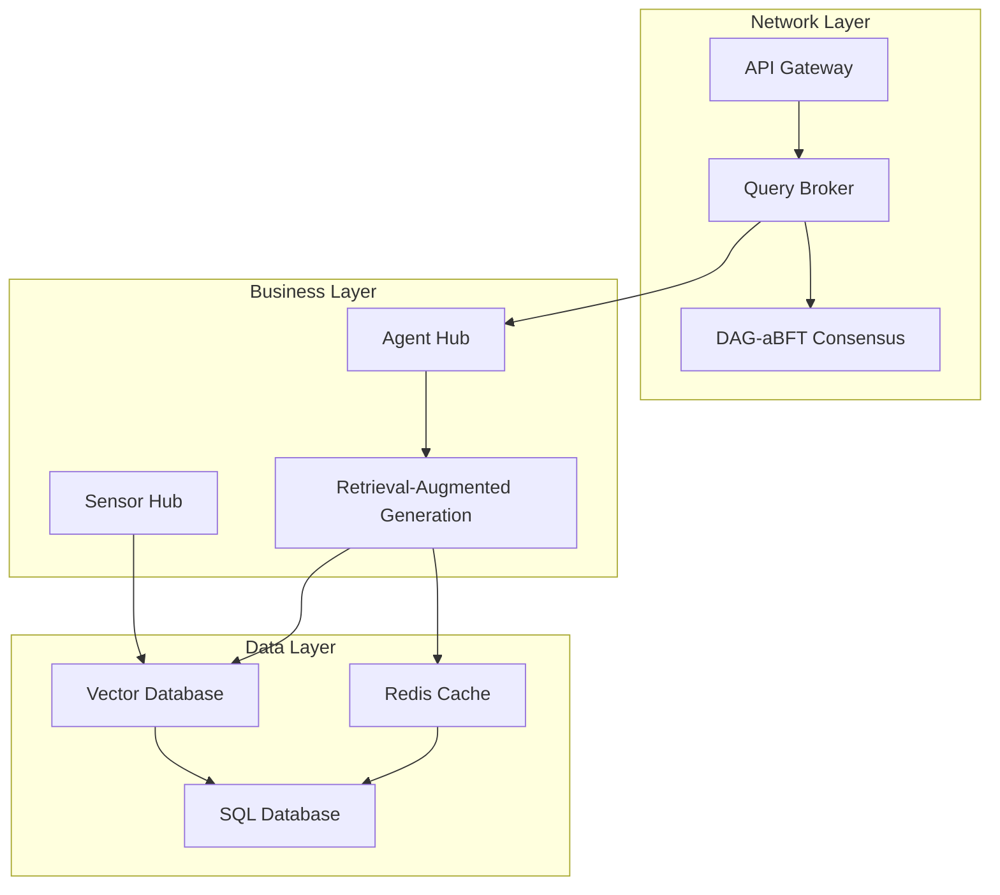
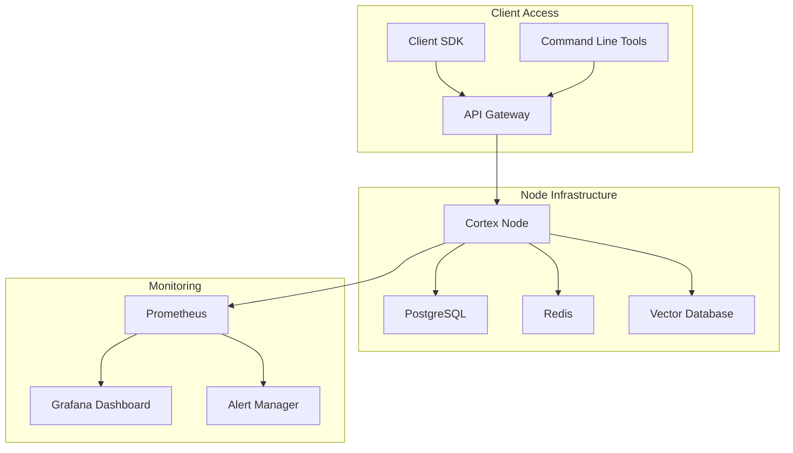

# Loreum Cortex Node: Implementation Plan

## Overview

This document outlines the technical implementation plan for developing the Loreum Cortex node in Golang. It serves as a prompt engineering guide for developers to implement the decentralized AI inference network as described in the architecture documentation. The implementation focuses on creating a robust p2p network that supports the DAG-aBFT consensus mechanism and enables the core functions of the Sensor Hub, Agent Hub, and RAG system.

## System Architecture

The Loreum Cortex node consists of three primary layers:



## Technical Specifications

### 1. Network Layer

#### 1.1 P2P Communication (libp2p)

```go
type NetworkConfig struct {
    ListenAddresses []string
    BootstrapPeers  []string
    PrivateKey      crypto.PrivKey
    Protocols       []protocol.ID
}

type P2PNode struct {
    Host          host.Host
    DHT           *dht.IpfsDHT
    PeerDiscovery discovery.Discovery
    PubSub        *pubsub.PubSub
    Topics        map[string]*pubsub.Topic
}
```

**Core Libraries:**
- `github.com/libp2p/go-libp2p` - Main p2p networking stack
- `github.com/libp2p/go-libp2p-kad-dht` - Peer discovery via Kademlia DHT
- `github.com/libp2p/go-libp2p-pubsub` - Gossip protocol implementation

#### 1.2 API Gateway

RESTful and gRPC APIs supporting:
- Query submission
- Node status monitoring
- Transaction tracking
- Authentication and rate limiting

#### 1.3 Consensus Mechanism (DAG-aBFT)

```go
type Transaction struct {
    ID        string
    Timestamp time.Time
    Data      string  // Query data
    Parents   []string
    Signature []byte
    Finalized bool
}

type DAGNode struct {
    Transaction *Transaction
    Children    []*DAGNode
    Score       float64  // Reputation-weighted score
}

type ConsensusService struct {
    DAG                *DAG
    TransactionPool    *Pool
    ReputationManager  *ReputationManager
    ValidationRules    []ValidationRule
    FinalizationThreshold float64
}
```

### 2. Business Layer

#### 2.1 Agent Hub

```go
type Agent interface {
    Process(context.Context, *Query) (*Response, error)
    GetCapabilities() []Capability
    GetPerformanceMetrics() Metrics
}

type AgentHub struct {
    Agents       map[string]Agent
    Router       *QueryRouter
    Orchestrator *TaskOrchestrator
}

// Core agents
type ParserAgent struct {}
type RetrieverAgent struct {}
type RankerAgent struct {}
type SolverAgent struct {}
type SlasherAgent struct {}
type AccountAgent struct {}
```

#### 2.2 Sensor Hub

```go
type Sensor interface {
    Start(ctx context.Context) error
    Stop() error
    GetData(query string) ([]byte, error)
    Subscribe(channel chan<- SensorEvent)
}

type SensorHub struct {
    Sensors     map[string]Sensor
    EventBus    *EventBus
    Processor   *DataProcessor
}

// Example sensor implementations
type BlockchainSensor struct {}
type APISensor struct {}
type SocialMediaSensor struct {}
```

#### 2.3 RAG System

```go
type RAGSystem struct {
    VectorDB        *VectorDatabase
    QueryProcessor  *QueryProcessor
    ModelManager    *ModelManager
    ContextBuilder  *ContextBuilder
}

type VectorQuery struct {
    Embedding       []float32
    MaxResults      int
    MinSimilarity   float32
}
```

### 3. Data Layer

#### 3.1 Storage Services

```go
type StorageService interface {
    Store(key string, value []byte) error
    Retrieve(key string) ([]byte, error)
    Delete(key string) error
}

type SQLStorage struct {
    DB *sql.DB
}

type RedisStorage struct {
    Client *redis.Client
}

type VectorStorage struct {
    Store  StorageService
    Index  *VectorIndex
}
```

## Implementation Phases

### Phase 1: Core P2P Network (Weeks 1-3)

1. **Network Foundation**
   - Implement libp2p host configuration
   - Set up DHT for peer discovery
   - Configure connection management
   - Implement basic peer authentication

2. **Transaction Propagation**
   - Develop gossip protocol integration
   - Implement transaction structure
   - Create transaction validation logic
   - Set up transaction pool management

3. **Basic Consensus Mechanism**
   - Implement DAG structure
   - Develop parent selection algorithm
   - Create finality determination logic
   - Implement cryptographic verification

### Phase 2: Business Layer Core (Weeks 4-6)

1. **Agent Hub Framework**
   - Develop agent interface
   - Implement core agents (Parser, Retriever, etc.)
   - Create agent routing logic
   - Set up parallel processing capabilities

2. **Sensor Hub Basics**
   - Implement sensor interface
   - Develop data transformation pipeline
   - Create basic sensor implementations
   - Set up event-driven architecture

3. **RAG System Foundation**
   - Implement vector embedding generation
   - Develop similarity search functionality
   - Create context-building capabilities
   - Set up model inference interfaces

### Phase 3: Data Layer & Storage (Weeks 7-8)

1. **Storage Integration**
   - Implement SQL database integration
   - Set up Redis caching
   - Develop vector database capabilities
   - Create data migration utilities

2. **Query Processing Pipeline**
   - Implement end-to-end query flow
   - Develop data retrieval optimization
   - Create response generation logic
   - Set up security and access control

### Phase 4: Reputation & Economics (Weeks 9-10)

1. **Reputation System**
   - Implement performance tracking
   - Develop trust calculation algorithms
   - Create slashing mechanism
   - Set up stake management

2. **Economic Incentives**
   - Implement payment distribution
   - Develop reward calculation
   - Create transaction fee management
   - Set up stablecoin integration

### Phase 5: Testing & Optimization (Weeks 11-12)

1. **Testing Framework**
   - Develop unit test suite
   - Create integration tests
   - Implement benchmarking tools
   - Set up CI/CD pipeline

2. **Performance Optimization**
   - Identify bottlenecks
   - Optimize critical paths
   - Improve resource utilization
   - Enhance scalability

## Code Structure

```
cortex/
├── cmd/
│   └── cortexd/               # Main executable
├── internal/
│   ├── api/                   # API Gateway
│   ├── consensus/             # DAG-aBFT implementation
│   ├── p2p/                   # P2P networking
│   ├── agenthub/              # Agent implementations
│   ├── sensorhub/             # Sensor implementations
│   ├── rag/                   # RAG system
│   ├── storage/               # Data storage
│   └── reputation/            # Reputation system
├── pkg/
│   ├── types/                 # Shared data types
│   ├── crypto/                # Cryptographic utilities
│   ├── config/                # Configuration management
│   └── util/                  # Shared utilities
├── test/                      # Test suites
├── scripts/                   # Deployment scripts
└── docs/                      # Documentation
```

## Development Environment

### Prerequisites
- Go 1.20 or higher
- Docker and Docker Compose
- PostgreSQL 14+
- Redis 7+
- Vector database (Milvus/Qdrant/Weaviate)

### Development Tools
- VS Code with Go extensions
- GoLand IDE
- Delve debugger
- Go test framework
- Grafana/Prometheus for monitoring

## Implementation Guidelines

### 1. P2P Network Best Practices

```go
// Example of setting up a libp2p host
func NewP2PNode(cfg *NetworkConfig) (*P2PNode, error) {
    // Setup options for the libp2p host
    options := []libp2p.Option{
        libp2p.ListenAddrStrings(cfg.ListenAddresses...),
        libp2p.Identity(cfg.PrivateKey),
        libp2p.DefaultSecurity,
        libp2p.DefaultMuxers,
        libp2p.DefaultTransports,
        libp2p.NATPortMap(),
    }

    // Create a new libp2p host
    host, err := libp2p.New(options...)
    if err != nil {
        return nil, err
    }

    // Create a new DHT for peer discovery
    dht, err := dht.New(context.Background(), host)
    if err != nil {
        return nil, err
    }

    // Create a new pubsub service
    pubsub, err := pubsub.NewGossipSub(context.Background(), host)
    if err != nil {
        return nil, err
    }

    return &P2PNode{
        Host:   host,
        DHT:    dht,
        PubSub: pubsub,
        Topics: make(map[string]*pubsub.Topic),
    }, nil
}
```

### 2. DAG-aBFT Implementation

```go
// Example of transaction creation and validation
func CreateTransaction(data string, parents []string, privKey ed25519.PrivateKey) (*Transaction, error) {
    // Create a timestamp
    timestamp := time.Now()
    
    // Create a hash of the data and timestamp
    dataToHash := data + timestamp.String() + strings.Join(parents, "")
    hash := sha256.Sum256([]byte(dataToHash))
    
    // Sign the hash with the private key
    signature := ed25519.Sign(privKey, hash[:])
    
    // Create the transaction
    tx := &Transaction{
        ID:        hex.EncodeToString(hash[:]),
        Timestamp: timestamp,
        Data:      data,
        Parents:   parents,
        Signature: signature,
        Finalized: false,
    }
    
    return tx, nil
}

func ValidateTransaction(tx *Transaction, pubKey ed25519.PublicKey) bool {
    // Recreate the hash
    dataToHash := tx.Data + tx.Timestamp.String() + strings.Join(tx.Parents, "")
    hash := sha256.Sum256([]byte(dataToHash))
    
    // Verify the signature
    return ed25519.Verify(pubKey, hash[:], tx.Signature)
}
```

### 3. Agent Implementation

```go
// Example of implementing a core agent
type SolverAgent struct {
    models     map[string]*AIModel
    predictor  *Predictor
    config     *SolverConfig
}

func NewSolverAgent(config *SolverConfig) *SolverAgent {
    return &SolverAgent{
        models:    make(map[string]*AIModel),
        predictor: NewPredictor(config.PredictorConfig),
        config:    config,
    }
}

func (s *SolverAgent) Process(ctx context.Context, query *Query) (*Response, error) {
    // Select appropriate model based on query type
    model, err := s.selectModel(query)
    if err != nil {
        return nil, err
    }
    
    // Prepare input for the model
    input, err := s.prepareInput(query)
    if err != nil {
        return nil, err
    }
    
    // Run inference
    output, err := s.predictor.Predict(ctx, model, input)
    if err != nil {
        return nil, err
    }
    
    // Format response
    response, err := s.formatResponse(output)
    if err != nil {
        return nil, err
    }
    
    return response, nil
}
```

### 4. Sensor Implementation

```go
// Example of implementing a blockchain sensor
type BlockchainSensor struct {
    client      *ethclient.Client
    filters     map[string]*Filter
    eventChan   chan SensorEvent
    ctx         context.Context
    cancel      context.CancelFunc
}

func NewBlockchainSensor(endpoint string) (*BlockchainSensor, error) {
    client, err := ethclient.Dial(endpoint)
    if err != nil {
        return nil, err
    }
    
    ctx, cancel := context.WithCancel(context.Background())
    
    return &BlockchainSensor{
        client:    client,
        filters:   make(map[string]*Filter),
        eventChan: make(chan SensorEvent, 100),
        ctx:       ctx,
        cancel:    cancel,
    }, nil
}

func (s *BlockchainSensor) Start(ctx context.Context) error {
    // Set up event listeners for each filter
    for id, filter := range s.filters {
        go s.watchEvents(id, filter)
    }
    
    return nil
}

func (s *BlockchainSensor) watchEvents(id string, filter *Filter) {
    // Set up log filter
    query := ethereum.FilterQuery{
        Addresses: filter.Addresses,
        Topics:    filter.Topics,
    }
    
    logs := make(chan types.Log)
    sub, err := s.client.SubscribeFilterLogs(s.ctx, query, logs)
    if err != nil {
        // Handle error
        return
    }
    
    // Process logs
    for {
        select {
        case err := <-sub.Err():
            // Handle subscription error
            return
        case log := <-logs:
            // Process log and emit event
            event := SensorEvent{
                SensorID: id,
                Data:     log,
                Time:     time.Now(),
            }
            s.eventChan <- event
        case <-s.ctx.Done():
            return
        }
    }
}
```

## Testing Strategy

### 1. Unit Testing
- Test individual components in isolation
- Mock dependencies for controlled testing
- Aim for >80% code coverage

### 2. Integration Testing
- Test component interactions
- Set up local test networks
- Validate end-to-end flows

### 3. Performance Testing
- Measure transaction throughput
- Evaluate latency under load
- Assess resource utilization

### 4. Chaos Testing
- Simulate network partitions
- Test node failures
- Evaluate Byzantine fault scenarios

## Deployment Architecture



## Conclusion

This implementation plan provides a comprehensive guide for developing the Loreum Cortex node in Golang. By following this plan, developers can create a robust, scalable, and efficient p2p network that supports the decentralized AI inference capabilities described in the architecture documentation. The modular approach allows for incremental development and testing, ensuring a stable and reliable system.

## References
1. Loreum Architecture Documentation
2. Cortex Technical Specification
3. DAG-aBFT Consensus Mechanism
4. libp2p Documentation
5. Golang Best Practices 